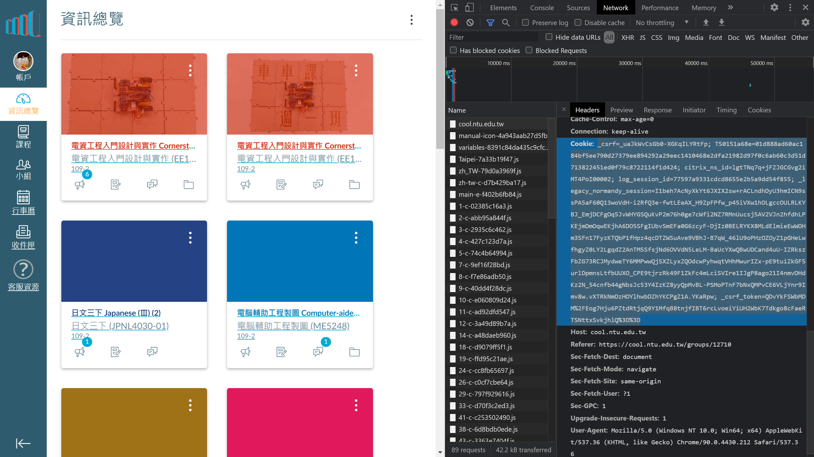

# NTU-Cool-Catcher
[NTU COOL](https://cool.ntu.edu.tw/)(NTU COurse OnLine)教學資源下載工具，一次性下載指定課程的所有內容，包括檔案和影片。

## 取得
本專案使用[Python3](https://www.python.org/downloads/)，請確認已經安裝

下載
```
git clone https://github.com/chaoshaowei/NTU-Cool-Catcher.git
```

升級
```
git pull https://github.com/chaoshaowei/NTU-Cool-Catcher.git
```

## 特性
- 使用Database記錄已經下載的檔案，下次能繼續下載
- 自動下載最高解析度的影片

## 使用說明
### Cookie.txt
這個檔案為必要檔案，需要**登入後**取得。Cookie取得方法如下所示：
1. 登入NTU COOL
2. 按 ```F12``` 開啓開發人員選項
3. 選擇Network區塊並重新整理
4. 找到 ```cool.ntu.edu.tw```
5. 將Cookie的所有資訊，複製到 ```cookie.txt``` 中



### 選擇下載之課程
目前只能在程式碼中，修改```COURSE_NUMS```變數
